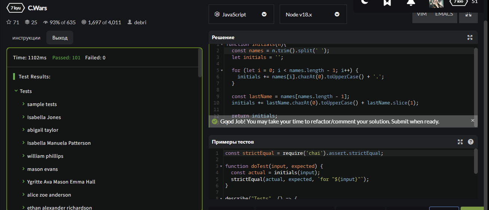

<p align = "center">МИНИСТЕРСТВО НАУКИ И ВЫСШЕГО ОБРАЗОВАНИЯ<br>
РОССИЙСКОЙ ФЕДЕРАЦИИ<br>
ФЕДЕРАЛЬНОЕ ГОСУДАРСТВЕННОЕ БЮДЖЕТНОЕ<br>
ОБРАЗОВАТЕЛЬНОЕ УЧРЕЖДЕНИЕ ВЫСШЕГО ОБРАЗОВАНИЯ<br>
«САХАЛИНСКИЙ ГОСУДАРСТВЕННЫЙ УНИВЕРСИТЕТ»</p>
<br><br><br><br><br><br>
<p align = "center">Институт естественных наук и техносферной безопасности<br>Кафедра информатики<br>Чернявский Роман Евгеньевич</p>
<br><br><br>
<p align = "center"><br><strong>Лабораторная работа №6.«CSS»</strong><br>01.03.02 Прикладная математика и информатика</p>
<br><br><br><br><br><br><br><br><br><br><br><br>
<p align = "right">Научный руководитель<br>
Соболев Евгений Игоревич</p>
<br><br><br>
<p align = "center">г. Южно-Сахалинск<br>2024 г.</p>
<br><br><br><br><br><br><br><br><br><br><br><br>

<h1 align = "center">Введение</h1>

<p><b>Среда разработки html (HyperText Markup Language)</b> — это язык разметки, который используется для создания веб-страниц. HTML определяет структуру содержимого веб-страницы, такие как заголовки, параграфы, списки, ссылки и изображения. HTML состоит из набора тегов, которые определяют различные элементы страницы и их отображение в браузере.</p>

<p><b>JavaScript</b> — мультипарадигменный язык программирования. Поддерживает объектно-ориентированный, императивный и функциональный стили.</p>

<br>
<h1 align = "center">Цели и задачи</h1>


<p>Требуется выполнить задания, применяя полученные знания на лекциях и взятые из интернета.</p>

<p> 1.  Придумайте селектор, который выберет абзацы <p> внутри дивов <div>. </p>

<p>2.	Придумайте селектор, который выберет все <h2> внутри дивов <div>.</p>

<p>3.	Придумайте селектор, который выберет все абзацы <p> из элемента с id=test.</p>

<p>4.	Придумайте селектор, который выберет все <h2> из элемента с id=test.</p>

<p>5.	Выберите все элементы с классом bbb.</p>

<p>6.	Выберите все элементы с классом bbb из элемента с id=test.</p>

<p>7.	Выберите все абзацы <p> с классом bbb.</p>

<p>8.	Выберите все <h2> с классом bbb</p>

<p>9.	Выберите все абзацы <p> с классом bbb из элемента с id=test.</p>

<p>10.	Выберите все элементы с классом bbb и элементы с классом xxx одновременно.</p>

<p>11.	Выберите все абзацы <p> с классом bbb и <h2> с классом xxx одновременно.</p>

<p>12.	Выберите все абзацы <p> с классом bbb из id=test и все абзацы <p> с классом xxx из id=test одновременно.</p>

<p>13.	Выберите все элементы из класса fff.</p>

<p>14.	Выберите все абзацы <p> из класса fff.</p>

<p>15.	Выберите все абзацы <p> с классом fff.</p>

<p>16.	Выберите все элементы с классом bbb из класса fff.</p>

<p>17.	Выберите все <h2> с классом bbb из класса fff.</p>

<p>18.	Сделайте селектор, который выберет все ссылки из id=test, с состояния link и visited сделайте неподчеркнутыми и красными, а состояние hover - подчеркнутым и голубым.</p>

<p>19.	 Сделайте селектор, который выберет все ссылки с классом www, состояния link и visited сделайте подчеркнутыми и голубыми, а состояние hover - неподчеркнутым.</p>
<p>20.	 Сделайте селектор, который выберет все ссылки из id=test с классом www. Цвета состояний выберите самостоятельно.</p>
<p>21.  Сделайте селектор, который выберет все ссылки из class=eee с классом www. Цвета состояний выберите самостоятельно.</p>
<p>22.	Повторите страницу по данному по образцу:</p>
<p>23.	Повторите страницу по данному по образцу:</p>
<p>24.	Повторите страницу по данному по образцу:</p>
<p>25.	Повторите страницу по данному по образцу:</p>
<p>26.	Повторите страницу по данному по образцу:</p>
<p>27.	Повторите страницу по данному по образцу:</p>

<p></p>


<h1 align = "center">Решение</h1>

<p>Для выполнения этой лабораторной работы, я пользовался материалом из интернета и того, что мы проходили на лекциях</p>

<h2 align = "center">Файл "1.html"</h2>

```
<!DOCTYPE html>
<html lang="en">
<head>
    <meta charset="UTF-8">
    <title>1</title>
</head>
<style>
    div p {
        color: green;
        font-style: italic;
    }
</style>
<body>
<div>
    <p>Этот селектор применит указанные стили ко всем абзацам p, которые являются потомками элементов div на любом уровне вложенности.</p>
</div>
</body>
</html>
```

<h2 align = "center">Файл "2.html"</h2>

```
<!DOCTYPE html>
<html lang="en">
<head>
    <meta charset="UTF-8">
    <title>2</title>
</head>
    <style>
        div h2 {
            color: green;
            font-style: italic;
        }
    </style>
<body>
    <div>
        <h2>Этот селектор применит указанные стили ко всем абзацам h2, которые являются потомками элементов div на любом уровне вложенности.</h2>
    </div>
</body>
</html>
```

<h2 align = "center">Файл "3.html"</h2>

```
<!DOCTYPE html>
<html lang="en">
<head>
    <meta charset="UTF-8">
    <title>3</title>
</head>
    <style>
        #test p {
            color: green;
            font-style: italic;
        }
    </style>
<body>
    <div id='test'>
        <p>Этот селектор применит указанные стили ко всем абзацам p, которые находятся внутри элемента с id="test".</p>
    </div>
</body>
</html>
```

<h2 align = "center">Файл "4.html"</h2>

```
<!DOCTYPE html>
<html lang="en">
<head>
    <meta charset="UTF-8">
    <title>4</title>
</head>
    <style>
        #test h2 {
            color: green;
            font-style: italic;
        }
    </style>
<body>
    <div id='test'>
        <h2>Этот селектор применит указанные стили ко всем абзацам h2, которые находятся внутри элемента с id="test".</h2>
    </div>
</body>
</html>

```

<h2 align = "center">Файл "5.html"</h2>

```
<!DOCTYPE html>
<html lang="en">
<head>
    <meta charset="UTF-8">
    <title>5</title>
</head>
    <style>
        .bbb {
            color: blue;
            font-weight: bold;
        }
    </style>
<body>
    <div class="bbb">
        <p>Элемент класса bbb.</p>
    </div>
    <div class="bbb">
        <p>Элемент класса bbb.</p>
    </div>
    <div class="bbb">
        <p>Элемент класса bbb.</p>
    </div>
    <div class="bbb">
        <p>Элемент класса bbb.</p>
    </div>
    <div class="bbb">
        <p>Элемент класса bbb.</p>
    </div>
    <div class="bbb">
        <p>Элемент класса bbb.</p>
    </div>
</body>
</html>
```

<h2 align = "center">Файл "6.html"</h2>

```
<!DOCTYPE html>
<html lang="en">
<head>
    <meta charset="UTF-8">
    <title>6</title>
</head>
    <style>
        #test .bbb {
            color: blue;
            font-weight: bold;
        }
    </style>
<body>
    <div id="test">
        <div class="bbb">
            <p>Элемент класса bbb.</p>
        </div>
        
        <div class="bbb">
            <p>Элемент класса bbb.</p>
        </div>

        <div class="bbb">
            <p>Элемент класса bbb.</p>
        </div>

        <div class="bbb">
            <p>Элемент класса bbb.</p>
        </div>

        <div class="bbb">
            <p>Элемент класса bbb.</p>
        </div>

        <div class="bbb">
            <p>Элемент класса bbb.</p>
        </div>
    </div>
</body>
</html>
```

<h2 align = "center">Файл "7.html"</h2>

```
<!DOCTYPE html>
<html lang="en">
<head>
    <meta charset="UTF-8">
    <title>7</title>
</head>
    <style>
        p.bbb {
            color: blue;
            font-weight: bold;
        }
    </style>
<body>
    <div id="test">
        <p class="bbb">
            Элемент класса bbb.
        </p>
        
        <p class="bbb">
            Элемент класса bbb.
        </p>

        <p class="bbb">
            Элемент класса bbb.
        </p>

        <p class="bbb">
            Элемент класса bbb.
        </p>

        <p class="bbb">
            Элемент класса bbb.
        </p>

        <p class="bbb">
            Элемент класса bbb.
        </p>
    </div>
</body>
</html>
```

<h2 align = "center">Файл "8.html"</h2>

```
<!DOCTYPE html>
<html lang="en">
<head>
    <meta charset="UTF-8">
    <title>8</title>
</head>
    <style>
        h2.bbb {
            color: blue;
            font-weight: bold;
        }
    </style>
<body>
    <div id="test">
        <h2 class="bbb">
            Элемент класса bbb.
        </h2>
        
        <h2 class="bbb">
            Элемент класса bbb.
        </h2>

        <h2 class="bbb">
            Элемент класса bbb.
        </h2>

        <h2 class="bbb">
            Элемент класса bbb.
        </h2>

        <h2 class="bbb">
            Элемент класса bbb.
        </h2>

        <h2 class="bbb">
            Элемент класса bbb.
        </h2>
    </div>
</body>
</html>
```

<h2 align = "center">Файл "9.html"</h2>

```
<!DOCTYPE html>
<html lang="en">
<head>
    <meta charset="UTF-8">
    <title>9</title>
</head>
    <style>
        #test p.bbb {
            color: blue;
            font-weight: bold;
        }
    </style>
<body>
    <div id="test">
        <p class="bbb">
            Элемент класса bbb.
        </p>
        
        <p class="bbb">
            Элемент класса bbb.
        </p>

        <p class="bbb">
            Элемент класса bbb.
        </p>

        <p class="bbb">
            Элемент класса bbb.
        </p>

        <p class="bbb">
            Элемент класса bbb.
        </p>

        <p class="bbb">
            Элемент класса bbb.
        </p>
    </div>
</body>
</html>
```

<h2 align = "center">Файл "10.html"</h2>

```
<!DOCTYPE html>
<html lang="en">
<head>
    <meta charset="UTF-8">
    <title>10</title>
</head>
    <style>
        .bbb, .xxx {
            color: blue;
            font-weight: bold;
        }
    </style>
<body>
    <div class="bbb">
        <p>Элемент класса bbb.</p>
    </div>

    <div class="bbb">
        <p>Элемент класса bbb.</p>
    </div>

    <div class="bbb">
        <p>Элемент класса bbb.</p>
    </div>

    <div class="xxx">
        <p>Элемент класса xxx.</p>
    </div>

    <div class="xxx">
        <p>Элемент класса xxx.</p>
    </div>

    <div class="xxx">
        <p>Элемент класса xxx.</p>
    </div>
</body>
</html>
```

<h2 align = "center">Файл "11.html"</h2>

```
<!DOCTYPE html>
<html lang="en">
<head>
    <meta charset="UTF-8">
    <title>11</title>
</head>
    <style>
        p.bbb, h2.xxx {
            color: blue;
            font-weight: bold;
        }
    </style>
<body>
    <p class="bbb">
        Элемент класса bbb.
    </p>

    <p class="bbb">
        Элемент класса bbb.
    </p>

    <p class="bbb">
        Элемент класса bbb.
    </p>

    <h2 class="xxx">
        Элемент класса xxx.
    </h2>

    <h2 class="xxx">
        Элемент класса xxx.
    </h2>

    <h2 class="xxx">
        Элемент класса xxx.
    </h2>
</body>
</html>
```

<h2 align = "center">Файл "12.html"</h2>

```
<!DOCTYPE html>
<html lang="en">
<head>
    <meta charset="UTF-8">
    <title>12</title>
</head>
    <style>
        #test p.bbb, #test p.xxx {
            color: blue;
            font-weight: bold;
        }
    </style>
<body>
    <div id="test">
        <p class="bbb">
            Элемент класса bbb.
        </p>

        <p class="bbb">
            Элемент класса bbb.
        </p>

        <p class="bbb">
            Элемент класса bbb.
        </p>

        <p class="xxx">
            Элемент класса xxx.
        </p>

        <p class="xxx">
            Элемент класса xxx.
        </p>

        <p class="xxx">
            Элемент класса xxx.
        </p>
    </div>
</body>
</html>
```

<h2 align = "center">Файл "13.html"</h2>

```
<!DOCTYPE html>
<html lang="en">
<head>
    <meta charset="UTF-8">
    <title>13</title>
</head>
    <style>
        .fff * {
            color: yellowgreen;
            font-weight: bold;
        }
    </style>
<body>
    <div class="fff">
        <p>Элемент класса fff.</p>
        
        <p>Элемент класса fff.</p>

        <p>Элемент класса fff.</p>
    </div>
</body>
</html>
```

<h2 align = "center">Файл "14.html"</h2>

```
<!DOCTYPE html>
<html lang="en">
<head>
    <meta charset="UTF-8">
    <title>14</title>
</head>
    <style>
        .fff p {
            color: yellowgreen;
            font-weight: bold;
        }
    </style>
<body>
    <div class="fff">
        <p>Элемент класса fff.</p>
        
        <p>Элемент класса fff.</p>

        <p>Элемент класса fff.</p>
    </div>
</body>
</html>
```

<h2 align = "center">Файл "15.html"</h2>

```
<!DOCTYPE html>
<html lang="en">
<head>
    <meta charset="UTF-8">
    <title>15</title>
</head>
    <style>
        p.fff {
            color: yellowgreen;
            font-weight: bold;
        }
    </style>
<body>
    <p class="fff">Элемент класса fff.</p>
        
    <p class="fff">Элемент класса fff.</p>

    <p class="fff">Элемент класса fff.</p>
</body>
</html>
```

<h2 align = "center">Файл "16.html"</h2>

```
<!DOCTYPE html>
<html lang="en">
<head>
    <meta charset="UTF-8">
    <title>16</title>
</head>
    <style>
        .fff .bbb {
            color: yellowgreen;
            font-weight: bold;
        }
    </style>
<body>
    <div class="fff">
        <div class="bbb">Элемент класса fff.</div>
        
        <div class="bbb">Элемент класса fff.</div>

        <div class="bbb">Элемент класса fff.</div>

        <div class="bbb">Элемент класса fff.</div>
    </div>
</body>
</html>
```

<h2 align = "center">Файл "17.html"</h2>

```
<!DOCTYPE html>
<html lang="en">
<head>
    <meta charset="UTF-8">
    <title>16</title>
</head>
    <style>
        .fff h2.bbb {
            color: violet;
            font-weight: bold;
        }
    </style>
<body>
    <div class="fff">
        <h2 class="bbb">Элемент класса fff.</h2>
        
        <h2 class="bbb">Элемент класса fff.</h2>

        <h2 class="bbb">Элемент класса fff.</h2>

        <h2 class="bbb">Элемент класса fff.</h2>
    </div>
</body>
</html>
```

<h2 align = "center">Файл "18.html"</h2>

```
<!DOCTYPE html>
<html lang="en">
<head>
    <meta charset="UTF-8">
    <title>18</title>
    <style>
        #test a:link,
        #test a:visited {
            text-decoration: none;
            color: blueviolet;
        }

        #test a:hover {
            text-decoration: underline;
            color: #4d4dff;
        }
    </style>
</head>
<body>
    <div id="test">
        <p>Текст.</p>
        <p><a href="#">Ссылка</a> внутри элемента с id=test.</p>
        <p><a href="#">Ссылка №2</a> здесь.</p>
    </div>
</body>
</html>
```

<h2 align = "center">Файл "19.html"</h2>

```
<!DOCTYPE html>
<html lang="en">
<head>
    <meta charset="UTF-8">
    <title>19</title>
    <style>
        a.www:link,
        a.www:visited {
            text-decoration: underline;
            color: blueviolet;
        }

        a.www:hover {
            text-decoration: none;
        }
    </style>
</head>
<body>
    <a href="#" class="www">Ссылка №1</a>
    <a href="#" class="www">Ссылка №2</a>
    <a href="#">Ссылка №3</a>
</body>
</html>
```

<h2 align = "center">Файл "20.html"</h2>

```
<!DOCTYPE html>
<html lang="en">
<head>
    <meta charset="UTF-8">
    <title>20</title>
    <style>
        #test a.www {
            color: blueviolet;
            text-decoration: dashed;
        }

        #test a.www:visited {
            color: red;
        }

        #test a.www:hover {
            color: burlywood;
            text-decoration: underline;
        }
    </style>
</head>
<body>
    <div id="test">
        <a href="#" class="www">Ссылка №1</a>
        <a href="#" class="www">Ссылка №2</a>
        <a href="#">Ссылка №3</a>
    </div>
</body>
</html>
```

<h2 align = "center">Файл "21.html"</h2>

```
<!DOCTYPE html>
<html lang="en">
<head>
    <meta charset="UTF-8">
    <title>21</title>
    <style>
        .eee a.www {
            color: purple;
            text-decoration: dashed;
        }

        .eee a.www:visited {
            color: green;
        }

        .eee a.www:hover {
            color: red;
            text-decoration: underline;
        }
    </style>
</head>
<body>
    <div class="eee">
        <a href="#" class="www">Ссылка №1</a>
        <a href="#" class="www">Ссылка №2</a>
        <a href="#">Ссылка №3</a>
    </div>
    <div class="eee">
        <a href="#" class="www">Ссылка №4</a>
        <a href="#" class="www">Ссылка №5</a>
    </div>
</body>
</html>
```

<h2 align = "center">Файл "22.html"</h2>

```
<!DOCTYPE html>
<html lang="en">
<head>
    <meta charset="UTF-8">
    <title>22</title>
    <style>
        body {
            border-style: dotted;
            border-color: gray;
        }

        .underline {
            text-decoration: underline;
        }

        .strike {
            text-decoration: line-through;
            text-decoration-color: gray;
            text-decoration-thickness: 2px;
        }

        .overline {
            text-decoration: overline;
            text-decoration-color: gray;
            text-decoration-thickness: 2px;
        }
    </style>
</head>
<body>
    <p class="underline">Привет, мир!</p>
    <p class="strike">Привет, мир!</p>
    <p class="overline">Привет, мир!</p>
</body>
</html>
```

<h2 align = "center">Файл "23.html"</h2>

```
<!DOCTYPE html>
<html lang="en">
<head>
    <meta charset="UTF-8">
    <title>23</title>
    <style>
        body {
            border-style: dotted;
            border-color: gray;
        }
        .square {
            border: solid 1px #ff0000;
            width: 200px;
            height: 200px;
            margin: 20px;
        }
    </style>
</head>
<body>
    <div class="square"></div>
</body>
</html>
```

<h2 align = "center">Файл "24.html"</h2>

```
<!DOCTYPE html>
<html lang="en">
<head>
    <meta charset="UTF-8">
    <title>24</title>
    <style>
        body {
            border-style: dotted;
            border-color: gray;
        }
        .square {
            border: dotted 1px blue;
            width: 400px;
            height: 100px;
            margin: 10px;
        }
    </style>
</head>
<body>
    <div class="square"></div>
</body>
</html>
```

<h2 align = "center">Файл "25.html"</h2>

```
<!DOCTYPE html>
<html lang="en">
<head>
    <meta charset="UTF-8">
    <title>25</title>
    <style>
        body {
            border-style: dotted;
            border-color: gray;
        }
        .square {
            border: dotted 1px green;
            width: 350px;
            height: 350px;
            margin: 10px;
            border-radius: 10px 30px;
        }
    </style>
</head>
<body>
    <div class="square"></div>
</body>
</html>
```

<h2 align = "center">Файл "26.html"</h2>

```
<!DOCTYPE html>
<html lang="en">
<head>
    <meta charset="UTF-8">
    <title>26</title>
    <style>
        body {
            border-style: dotted;
            border-color: gray;
        }
        .round {
            border: solid 1px red;
            width: 100px;
            height: 100px;
            margin: 10px;
            border-radius: 50%;
        }
    </style>
</head>
<body>
    <div class="round"></div>
</body>
</html>
```

<h2 align = "center">Файл "27.html"</h2>

```
<!DOCTYPE html>
<html lang="en">
<head>
    <meta charset="UTF-8">
    <title>27</title>
    <style>
        body {
            border-style: dotted;
            border-color: gray;
        }
        .underline {
            text-decoration: underline;
        }

        .green {
            color: green;
        }

        .red {
            color: red;
        }

        .black {
            color: black;
            text-decoration: none;
        }
    </style>
</head>
<body>
    <div style="display: flex;flex-direction: column; margin: 20px; gap:20px;">
        <a href="#" class="underline green">Ссылка 1</a>
        <a href="#" class="underline red">Ссылка 2</a>
        <a href="#" class="black">Ссылка 3</a>
    </div>
</body>
</html>
```

<h2 align = "center">Файл "28.js"</h2>

```
function add() {
    if (arguments.length == 0) {
        return 0;
    }

    let res = 0;

    for (let i = 0; i < arguments.length; i++) {
        res += arguments[i]/(i+1);
    }

    return Math.round(res);
}
```

<h2 align = "center">Файл "29.js"</h2>

```
function arrayPacking(a) {
    return a.reduce((value, byte, i) => value + byte * Math.pow(256, i));
}
```

<h2 align = "center">Файл "30.js"</h2>

```
function charToAscii(string) {
    string = string.replace(/[^A-Za-zА-Яа-я]/g, '');

    if (string.length <= 0) {
        return null;
    }

    let res = {};

    for (let key in string) {console.log(string[key])
        if (res[string[key]] !== undefined) {
            continue;
        }

        res[string[key]] = string[key].charCodeAt(0);
    }

    return res;
}
```

<h2 align = "center">Файл "31.js"</h2>

```
function initials(n){
    const names = n.trim().split(' ');
    let initials = '';

    for (let i = 0; i < names.length - 1; i++) {
        initials += names[i].charAt(0).toUpperCase() + '.';
    }

    const lastName = names[names.length - 1];
    initials += lastName.charAt(0).toUpperCase() + lastName.slice(1);

    return initials;
}
```

<h2 align = "center">Файл "32.js"</h2>

```
function titleToNumber(title) {
  let columnNumber = 0;
  for (let i = 0; i < title.length; i++) {
    columnNumber *= 26;
    columnNumber += (title.charCodeAt(i) - 'A'.charCodeAt(0) + 1);
  }
  return columnNumber;
}
```

<h2 align = "center">Файл "33.js"</h2>

```
function maskify(cc) {
  return cc.slice(0, -4).replace(/./g, '#') + cc.slice(-4);
}
```

<h1 align = "center">Результат</h1>

<p align = "center"></p>

<p align = "center"></p>

<p align = "center"></p>

<p align = "center"></p>

<p align = "center"></p>

<p align = "center"></p>

<p align = "center">Итого мы получаем 33 программ, каждая из которых является решением соответсвующей задачи</p>

<h1 align = "center">Вывод</h1>
<p>По итогу проделанной лабораторной работы, я узнал о том, что такое JavaScript и использовал эти знания в решении задач.</p>
